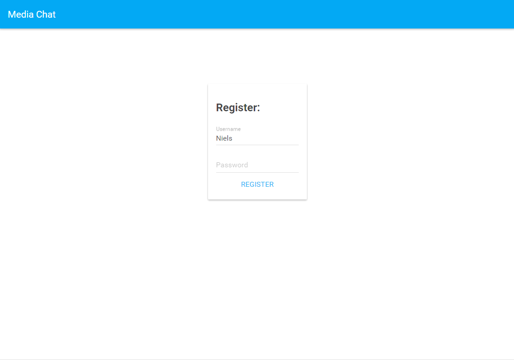
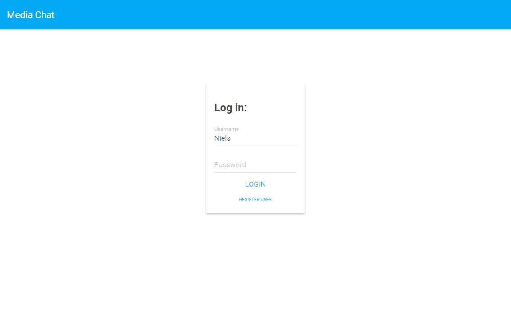
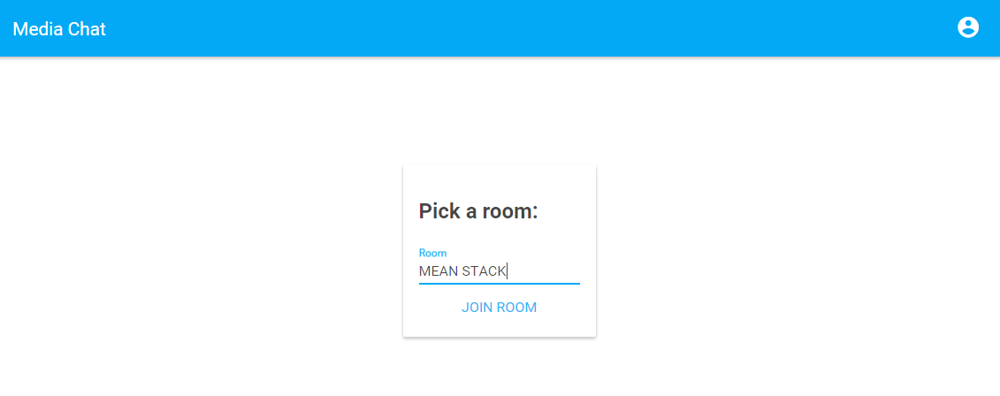
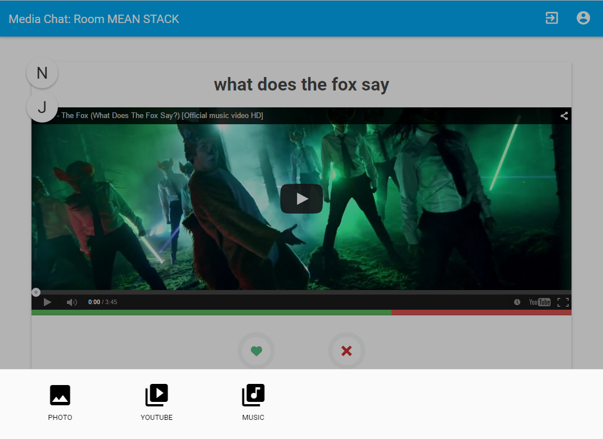
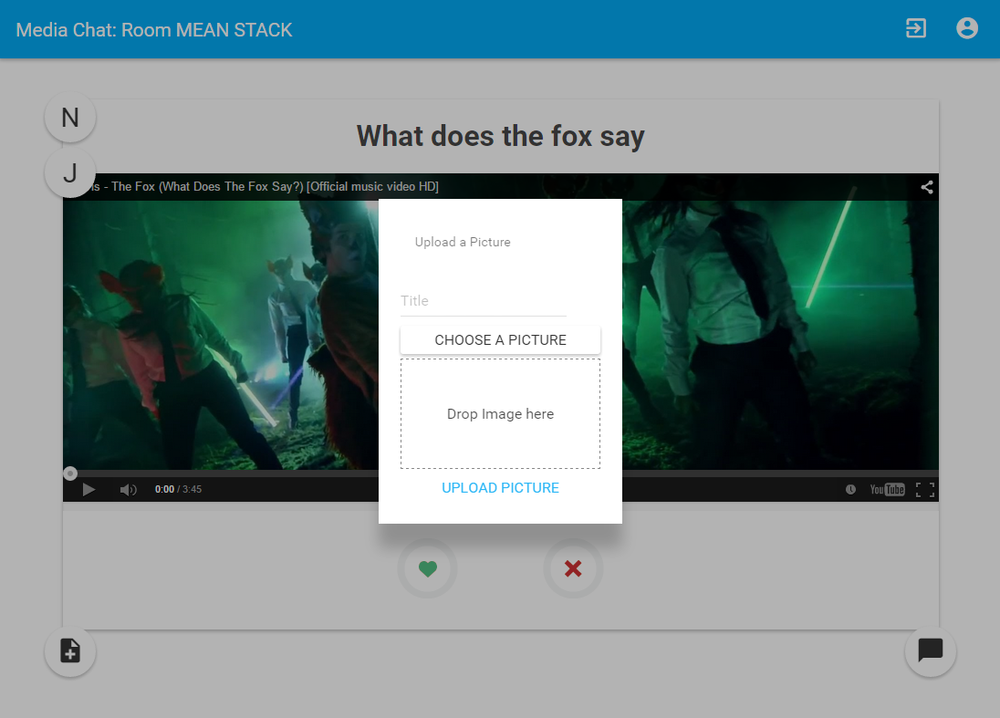
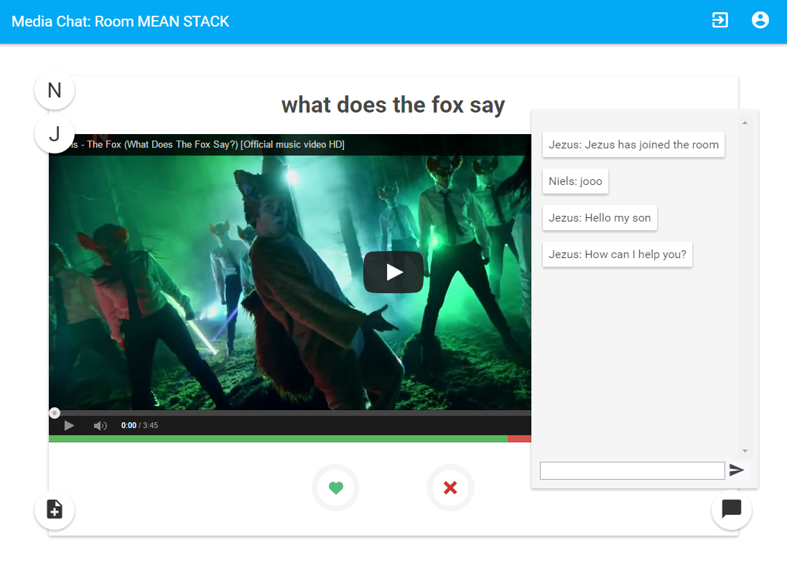

# Media chat with authentication #

Media chat app is a simple node.js application build with [AngularJS](https://angularjs.org/), [Angular Material](https://material.angularjs.org/) and [Sails](http://sailsjs.org).

With the application you can register, log in, join a room, upload a picture, youtube video or song to the room, rate the shared content and chat.   
This application was build as a school project for the course (experimental) "Backend Development" @ [NMCT](http://nmct.be).

## Overview ##

### Register ###

To register you have to give a username and password.   
You will be logged in if the account is successfully created and go to the room picker.

### Login ###

To log in you have to fill in your credentials that you gave up when you registered.   
You will go to the room picker if you log in successfully.

### Room Picker ###

Give in a rooms name that you want to join or create.

### Room ###

In the title of the appbar and in the url, you can see in which room you are.   
There are two actions on the right in the app bar. An action to leave the current room and an action to logout.

The circles on the left side are the users that are in the room.   
You can see the first letter of his or her name and when you hover over the circle, you can see the full name.

You can see the content in the middle. Every piece of content has a title and the content of course.  
You can vote yes or no by pressing the heart or the red cross beneath the content.   
The bar beneath the content represents the like versus dislikes.

To upload content, press the button on the lower left side.

### Upload Content ###

When you press the add new content button, a content picker will popup from the bottom.
You can choose between a picture, a youtube video and a sound file.

Once you have selected the type of content you want the upload, a corresponding form will popup.

### Chat ###

There is a button provided on the right lower side that shows or dismisses the chat room.
You get notified when a user joins the room, leaves the room, when a user is typing, and the message of course.

## Set-Up ##

Before running the application you must have successfully installed the following frameworks, tools.

* [Node.js](http://nodejs.org/)
* [npm](https://www.npmjs.com/)
* [Grunt](http://gruntjs.com/)
* [Bower](http://bower.io/)
* [MongoDB](http://www.mongodb.org/)
* [Sails](http://sailsjs.org)

Make sure all the command line tools are globally available in your command line.

Now run the following command in the root of the project or run the "installnpm.bat" file.

	npm install

You may run into issues when trying to install the "bcrypt" package.
Try to install ["node-gyp"](https://github.com/TooTallNate/node-gyp)(check the install requirements! I had to specify to node that I have a different version of Visual Studio).

If you have visual studio 2012 or 2013 on your machine, you could also run into issues installing the packages. You can find some suggestions over [stackoverflow](http://stackoverflow.com/questions/14278417/cannot-install-node-modules-that-require-compilation-on-windows-7-x64-vs2012).
	
There are two batch-files included to start the app faster.

* Run "rundb.bat" first to start the MongoDB database.
* Run "runapp.bat" after that to start the Sails application.

You can also manually start the app.   
In one command line window start de MongoDB with the following command.

	mongod --dbpath ".\data\db"
	
In another start Sails with the following command.

	sails lift

The app should now be running. By default it is running on port 1337.

